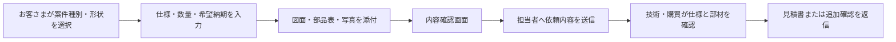

# ハーネス（電線加工）見積もり・ヒアリング機能 調査報告

対象: 株式会社ユタカエンジニアリング  
調査日: 2026-08-12  
目的: 実装前に、公開サイトで実際に利用されているハーネス加工の見積もり導線を確認し、導入する機能の範囲を決める。

## 結論

ハーネス加工は、図面・部品指定・数量・納期・品質条件の組み合わせで価格と製作可否が変わるため、初期導入では**自動で確定価格を出す仕組み**よりも、情報を整理して担当者へ渡す**段階式ヒアリングフォーム**が現実的です。公開事例にも、完全自動見積もり、仕様入力＋担当者確認、図面添付中心の3パターンが確認できます。[1] [2] [3] [4]

ユタカエンジニアリングには、次の二層構造を推奨します。

> **図面・部品表があるお客さま**は最短で正確な見積もりへ進み、**図面がないお客さま**は用途・数量・形状から相談を始められる。同じ画面の中で、分かる範囲だけを入力してもらう。

## 実際に導入されている公開事例

| サイト | 見積もり方式 | 主な入力・操作 | 実務上の示唆 |
|---|---|---|---|
| P板.com「1-Click見積」 | 定型仕様のオンライン見積もり | 電線／ハウジングから開始、試作・量産、数量、端末形状、電線サイズ・長さ、部品型番、加工、配線・色指定 | 仕様・部材・工程が標準化できる案件は、段階選択と即時見積もりに向く。[1] |
| 共立エレショップ「ハーネス加工 見積依頼フォーム」 | 担当者による個別見積もり | コネクタ1・2、電線、結線方法、数量、納期／価格／品質の優先順位、国内加工希望、図面添付 | 図面と仕様を1件にまとめ、担当者が判断する堅実なBtoB方式。最初の導入モデルとして参考になる。[2] |
| 清和電資工業「カスタムオーダー」 | 形状選択＋オンライン注文の入口 | 電線のみ、片側／両側コンタクト、片側／両側ハウジングなどの形状から開始 | 最初に形状を選ばせると、専門用語に慣れていない利用者でも入力を始めやすい。[3] |
| ワイヤーハーネスの大学「お見積りフォーム」 | 図面添付＋条件整理型 | 図面・ポンチ絵、見積もり内容、数量、納期、部品変更可否、ISO9001／RoHS／UL、用途 | 正式図面でなくても手書きスケッチ・写真を受け付け、相談開始の障壁を下げている。材料変更可否はコスト・納期提案にも有効。[4] |

## 何を画面で入力してもらうのか

### 画面1: 相談の入口

最初は難しい型番を聞かず、案件の状態を選んでもらいます。

| 項目 | 選択肢の例 | 意図 |
|---|---|---|
| ご相談内容 | 新規製作／既存品の追加製作／仕様変更／まず相談したい | 担当者が案件の難易度を即座に把握する |
| ハーネス形状 | 電線のみ／片側端末／両側端末／コネクタ付き／未定 | 分かる範囲で形を指定してもらう |
| 図面の有無 | 図面・部品表あり／手書きスケッチ・写真あり／なし | 次の質問の深さを切り替える |

### 画面2: 分かる範囲の仕様

図面がある場合は添付を主役にし、入力は補助にします。図面がない場合のみ、以下を順に尋ねます。

| 項目 | 例 | 必須度 |
|---|---|---|
| 希望数量 | 試作10本、初回100本、月産500本 | 必須 |
| 電線仕様 | UL1007 AWG24、長さ300mm、赤・黒 | 任意（分かる場合） |
| コネクタ／端子 | メーカー名、シリーズ、型番、指定なし | 任意（分かる場合） |
| 結線・端末処理 | ストレート、圧着、半田、マークチューブ | 任意（分かる場合） |
| 希望納期 | 例: 2026年9月末、未定 | 必須 |
| 優先条件 | 納期優先／価格優先／品質・規格優先 | 推奨 |
| 規格・検査 | RoHS、UL、導通検査、外観検査など | 任意 |
| 部材代替 | 代替提案可／指定品のみ | 推奨 |

### 画面3: 図面・写真と連絡先

添付欄には、PDF、DXF、DWG、Excel、画像、ZIPなどを受け付ける設計が考えられます。公開事例では、5MB・1ファイルに制限する方式と、10MBまでで手書きスケッチ・写真を許容する方式が確認できます。[2] [4]

実装時は、最初から添付の種類を厳しくし過ぎず、次のように案内するのが適切です。

> 「正式図面がなくてもご相談いただけます。手書きスケッチ、既存品の写真、部品表でも構いません。分かる資料をお送りください。」

連絡先は、会社名、部署、氏名、メールアドレス、電話番号を取得します。利用目的、個人情報の取扱い、図面・技術情報の取扱いを送信前に明示します。

## 見積もりの流れ

重要なのは、送信完了を「自動見積もり完了」と誤解させないことです。完了画面では、たとえば次のように案内します。

> 「ご依頼を受け付けました。内容を確認のうえ、担当者より1営業日以内を目安にご連絡します。仕様の確認が必要な場合は、追加でお伺いします。」

## 導入方式の比較

| 段階 | 提供するもの | 価格表示 | 向く状況 | 注意点 |
|---|---|---|---|---|
| **Phase 1: 相談・見積依頼フォーム** | 段階式ヒアリング、資料添付、担当者通知、受付メール | 表示しない | 仕様が多様で個別判断が必要な現在の業務 | 図面アップロードには安全な保管と通知の仕組みが必要 |
| **Phase 2: 見積もり準備支援** | 形状選択、部品候補、入力漏れチェック、概算リードタイムの案内 | 確定価格は表示しない | 問い合わせ品質を上げたい段階 | 部材マスタと質問分岐の整備が必要 |
| **Phase 3: 定型品の自動概算** | 規格化された電線・端子・長さ・数量に対する概算 | 概算のみ | 同一仕様の繰り返し案件が多い場合 | 部材価格、加工工数、ロット条件、例外処理の継続管理が必要 |

## ユタカエンジニアリングへの推奨案

初期導入は **Phase 1** を推奨します。目的は自動化ではなく、電話・メールで発生する聞き取りを整理し、見積もりの初動を速くすることです。フォームは1ページに詰め込まず、「相談内容」「仕様」「資料・連絡先」の3段階で進めます。

その後、実際の依頼を一定数蓄積して、どの仕様が繰り返し現れるかを確認します。繰り返し案件が多い領域だけをPhase 2、Phase 3へ進めれば、例外処理の多い業務に無理な自動価格計算を持ち込まずに済みます。

> **この段階で決めるべきこと**: 送信内容を受け取る担当部署、返信目安、受け付ける添付形式・容量、技術資料の保存期間、部材代替の提案可否。

## 実装前の確認事項

| 確認事項 | 決める内容 |
|---|---|
| 受付担当 | 見積もり依頼を最初に確認する部署・担当者 |
| 応答基準 | 例: 1営業日以内に受付連絡、3営業日以内に見積もりまたは追加質問 |
| 添付ファイル | 受け付ける拡張子、1件あたりの容量、最大ファイル数 |
| 情報保護 | 図面・部品表・連絡先の保管先、閲覧権限、削除基準 |
| 例外処理 | 図面なし、至急、海外向け規格、支給材、既存品追加製作の扱い |

## 参考サイト

[1]: https://www.p-ban.com/kiban/hns/csHnsEst.do "P板.com — 1-Click見積：ハーネス加工"
[2]: https://www.kyohritsu.com/HARNESSform/index.php "共立エレショップ — ハーネス加工 見積依頼フォーム"
[3]: https://www.shitauke.net/custom/ "清和電資工業 — ハーネス加工のカスタムオーダー"
[4]: https://wireharness.jp/estimate/ "ワイヤーハーネスの大学 — お見積りフォーム"
